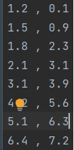
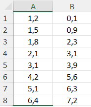

# Linear-Regression
This program read from txt or Excel file and calculate basic parameters of linear regresion.
## Built With
- Java

## Installation
* Clone the repo
  ```sh
  git clone https://github.com/WJarze/Linear-Regression.git
  ```
* data format for:
####
text:



####
excel:
####
 
####

## Future
Adding more regression methods and suggesting an appropriate regression method based on the correlation coefficient. Visualize data in charts.
